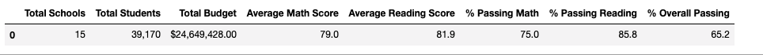

# School_District_Analysis

## Project Overview
The purpose of the following analysis was to build on previous work of analyzing a school districts test results by several different catergories.  In the original analysis, district math and reading scores were evaluated for pass criteria and then summarize by district, school, school type, spending per student relative to passing performance.  At the request of the school board, academic dishonesty was suspected in the 9th grade at Thomas High School.  The school board asked for the analysis to be redone but without the reading and math scores from the 9th graders at Thomas High School.  The grades for math and reading scores for these students were replaced with NaN values and their student count was adjusted to not affect the percentage or average calculations.  The results of the analysis are below with a comparison between the output from each method.
### Results
The results will compare the original data outputs to the Challenge outputs.  Commentary will follow below each set of figures.

##### District Summary
**Original**

**Challenge** 

In the district summary, the removal of the 9th grader scores from Thomas High School only dropped values around a tenth to three tenths of a percent on averages on reading and math as well as on overall passing rate.  Ultimately no other significant changes in the district summary were observed.  It should be noted that 461 students, representing the ninth graders from Thomas High were removed from the calculation.

#### School Summary
**Original** 

**Challenge**

Within the school summaries, all schools remained the same except for Thomas High School.  The changes for Thomas High were subtle.  Drops of a tenth of a point or less on average Math and Reading scores were observed.  Again a decrease between one and three tenths of a percent were observed in the passing rate of math, reading and overall passing percentage. 
#### Thomas High School performance relative to other schools
**Original**

**Challenge**

This subtle decrease did not affect the ranking of Thomas High School relative to other schools within the district.  As can be seen on the original and challenge Top School Summary tables above, Thomas High School rank second out of the schools reviewed even after removing the ninth graders scores.  The changes in percentages were not enough to affect the ranking of Thomas High School although the three thenths of a percent made the margin over Griffin High School much closer.

#### Math and Reading Score By Grade
##### Math
**Original**

**Challenge**

The only change in the Math Summary by grade is that the ninth graders value for math at Thomas High is now NaN reflecting their removal from the count in the challenge table display above.  No other changes were observed.

##### Reading
**Original**

**Challenge**

The only change in the Reading Summary by grade is that the ninth graders value for math at Thomas High is now NaN reflecting their removal from the count in the challenge table display above.  No other changes were observed.
#### Score by School Spending
**Original** 

**Challenge**

No changes are observed in the spending summary.  Changes made to Thomas High School were not significant to affect the spending summary.
#### Score by School Size
**Original** 

**Challenge**

No changes are observed in the size summary.  Changes made to Thomas High School were not significant to affect the size summary
#### Scores by School Type
**Original**

**Challenge** 

No changes are observed in the type summary.  Changes made to Thomas High School were not significant to affect the type summary.
### Summary
Four major changes in the updated school analysis include:
1) Updated total student count for overall, math, and reading percentages.  461 students (9th Graders at Thomas High) were removed the calculation.
2) No values are posted in the math score summary by grade level for the 9th graders at Thomas High School.  The value is now Nan.
3) No values are posted in the reading scores summary by grade level for the 9th graders at Thomas High School.  The value is now Nan.
4) The district and school summary show a minor drop of one thenth to three thenths of a percent drop in passing of math, reading and overall values.  Those are reflected in the capture images as previously noted.

