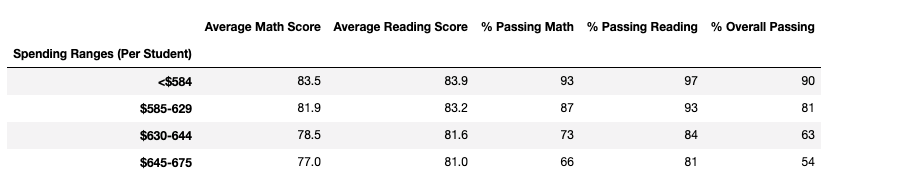

# School_District_Analysis

## Project Overview
The purpose of the following analysis was to build on previous work of analyzing a school districts test results by several different catergories.  In the original analysis, district math and reading scores were evaluated for pass criteria and then summarize by district, school, school type, spending per student relative to passing performance.  At the request of the school board, academic dishonesty was suspected in the 9th grade at Thomas High School.  The school board asked for the analysis to be redone but without the reading and math scores from the 9th graders at Thomas High School.  The grades for math and reading scores for these students were replaced with NaN values and their student count was adjusted to not affect the percentage or average calculations.  The results of the analysis are below with a comparison between the output from each method.
### Results
The results will compare the original data outputs to the Challenge outputs.  Commentary will follow below each set of figures.

##### District Summary
Original 
Challenge 
#### School Summary

Original 

Challenge 
#### Thomas High School performance relative to other schools

Original 

Challenge 
#### Math and Reading Score By Grade

##### Math
Original 

Challenge 

##### Reading

Original 

Challenge 

#### Score by School Spending

Original 

Challenge 

#### Score by School Size

Original 

Challenge 

#### Scores by School Type

Original 

Challenge 

### Summary
Four major changes in the updated school analysis include:
1) Updated total student count for overall, math, and reading percentages.  461 students (9th Graders at Thomas High) were removed the calculation.
2) No values are posted in the grade level school summary for the 9th grade population at Thomas High School.
3) Other
4) Other

